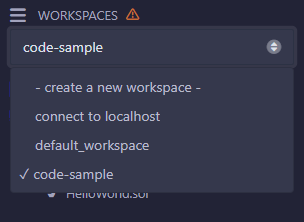
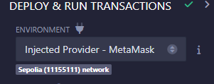
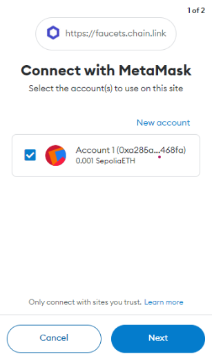

# Smart Contract Training
Ethereum, Solidity and Smart Contract code and research material to help train the next generation of Blockchain Engineers.

Deploy the contracts
===
In order to deploy a contract, open the file, copy its contents and paste into Remix, then go compile and deploy into the network.
After opening Remix (offline or online) remember that you can change the workspace/project in the top left corder.



I recommend using the Desktop Remix with an internal ledger (Remix VM) to execute the contracts, but you can also use the testnet (Sepolia)
by using the online version and choosing the Injected Provider for the environment.



If you choose metamask, open the wallet and aprove the connection:





Example
====
This is a simple contract that we can deploy and examine.
```solidity
// SPDX-License-Identifier: MIT
pragma solidity ^0.8.7;

contract HelloWorld {
    string public message;

    constructor(string memory initialMessage) {
        message = initialMessage;
    }

    function updateMessage(string memory newMessage) public {
        message = newMessage;
    }
}
```

## InvestmentFund
This is basic not 100% ready functional implementation of an Investment Fund. Invidual investors (Shareholders) deposit funds
into the smart contract which become available to the contract investor and coInvestor to purchase Coins, Tokens, Contracts which
should be also stored inside the contract

* Address (0x40BbA404d51e951FeeC83078bec24AE367546978)
* ([Explorer Address](https://sepolia.etherscan.io/address/0x40BbA404d51e951FeeC83078bec24AE367546978))

## Contract 2 (ETHUSD-Feed)
Ethereum/USD Price Feed based on ChainLink ETH/USD Feed(contract: 0x694AA1769357215DE4FAC081bf1f309aDC325306) rounded. 
Other methods were removed in order to showcase the important sections.
View complete code [here](./contracts/DataFeedWallet.sol)

```solidity
pragma solidity ^0.8.7;

import {AggregatorV3Interface} from "@chainlink/contracts/src/v0.8/shared/interfaces/AggregatorV3Interface.sol";

contract ETHUSDContract {
	//...
    constructor() {
        owner = msg.sender;
        dataFeed = AggregatorV3Interface(
            0x1b44F3514812d835EB1BDB0acB33d3fA3351Ee43
        );

        etherUSDFeed = AggregatorV3Interface(
            0x694AA1769357215DE4FAC081bf1f309aDC325306
        );
    }

    function deposit() public payable {
    	//...
    }

    function withdrawal(uint amount) public {
    	//...
    }

    function getBalance() public view returns (uint256) {
    	//...
    }

    function getETHUSD() public view returns (int) {
        (
            /* uint80 roundID */,
            int answer,
            /*uint startedAt*/,
            /*uint timeStamp*/,
            /*uint80 answeredInRound*/
        ) = etherUSDFeed.latestRoundData();
        int etherUsd = answer / 100000000.0;
        return etherUsd;
    }

}
```


# Relevant Links
* [Remix Editor Online](https://remix.ethereum.org/)
* [Remix Desktop (Download)](https://github.com/ethereum/remix-desktop/releases)
* [Metamax Wallet](https://metamask.io/)
* [Sepolia Testnet](https://sepolia.etherscan.io/)
* [Chain Link Docs](https://docs.chain.link/)
* [Getting Started Chain Link](https://docs.chain.link/data-streams/getting-started)
* [Introduction to Solidity](https://docs.soliditylang.org/en/v0.8.25/introduction-to-smart-contracts.html)

* [ChainLink TOKEN no Sepolia](https://sepolia.etherscan.io/token/0x779877a7b0d9e8603169ddbd7836e478b4624789?a=0xa285a56bb18cb9b41347efd9720066322c3468fa)


### Thank you